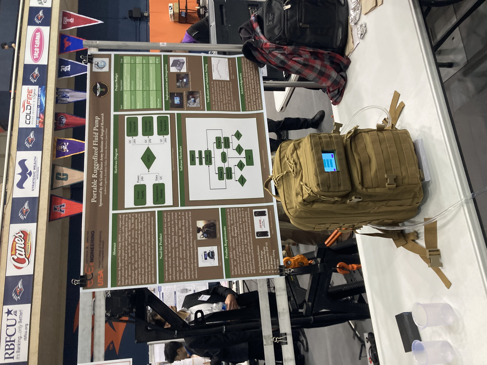

# Portable Ruggedized Fluid Pump

A modular, microcontroller-based fluid pumping system designed for use in rugged medical, military, or field-deployable environments. This project supports multiple pumps, touchscreen control, calibration, and serial/I2C interfaces.



---

## 🚀 Project Features

- 🧠 **ESP32-based firmware** written in Arduino/C++
- 💡 **Touchscreen GUI** using LVGL and TFT_eSPI libraries
- 🔁 **Multi-pump control** via I2C protocol
- ⚙️ **Multiple dispensing modes**, including:
  - Volume dispensing
  - Constant flow rate
  - Dose over time
  - Calibration mode
- 📟 **Serial CLI** for low-level operation & debugging
- 📄 **Technical documentation** and final report included

---

## 🛠️ Hardware Used

- ESP32 microcontroller
- 3.5” TFT Touch Display (480x320)
- Peristaltic Pumps (2x)
- 3D-printed rugged enclosure
- Supporting components (power supply, MOSFETs, buttons, etc.)

---

## 📂 Repository Structure

```plaintext
├── firmware/           # Main source files (.ino, .cpp, .h)
├── docs/               # Technical report, poster, and images
│   └── images/
├── touch.ino           # Touchscreen UI setup
├── pump_i2c.ino        # I2C pump controller
├── main.ino            # Core logic and CLI
└── README.md
